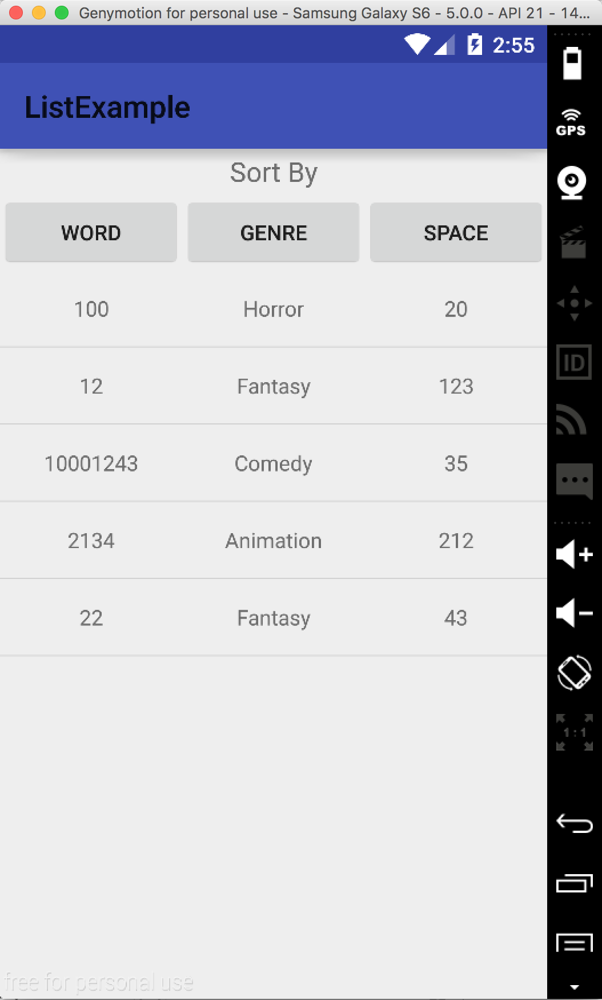

#  ListViews and ListAdapters - MadLibs Android pt. 2

## Introduction

> ***Note:*** _This can be a pair programming activity or done independently._

In this lab, you will be building a ListView that shows your collection of MadLibs from the last lab. The activity will have buttons to sort the madlibs by genre, number of words, and number of choosable spaces. Each sort will have a different layout for the list item, making the sorted category first on the list item.

## Exercise

#### Requirements

- Make 3 or more madlibs to add to the madlib from the previous lab (so minimum of 4 in total)
- Make a ListView display sorted madlibs
- Show genre, number of words, and choosable spaces for each list item
- On launch, the book shelf must be sorted by genre
- Allow the user to sort by genre, number of words, or choosable spaces
- Program should function as the previous lab when a mablib is chosen

**Bonus:**
- Allow new madlibs to be added to the listview
- Make the computer read the madlib aloud when a button is clicked
- Make the computer's voice customizeable so the user can listen to his/her madlib spoken in different ways

#### Starter code

The `starter-code` folder contains an Android project with the following:

- A completed sample app
- An example of how to use a custom comparator in the ExampleComparator.java file

#### Deliverable

Here's a screenshot for you. When the app loads, it should look like this

  

## Additional Resources

- [Java Listview](http://docs.oracle.com/javase/tutorial/uiswing/components/list.html)
- [Jave ListAdapters](https://developer.android.com/reference/android/widget/ListAdapter.html)
